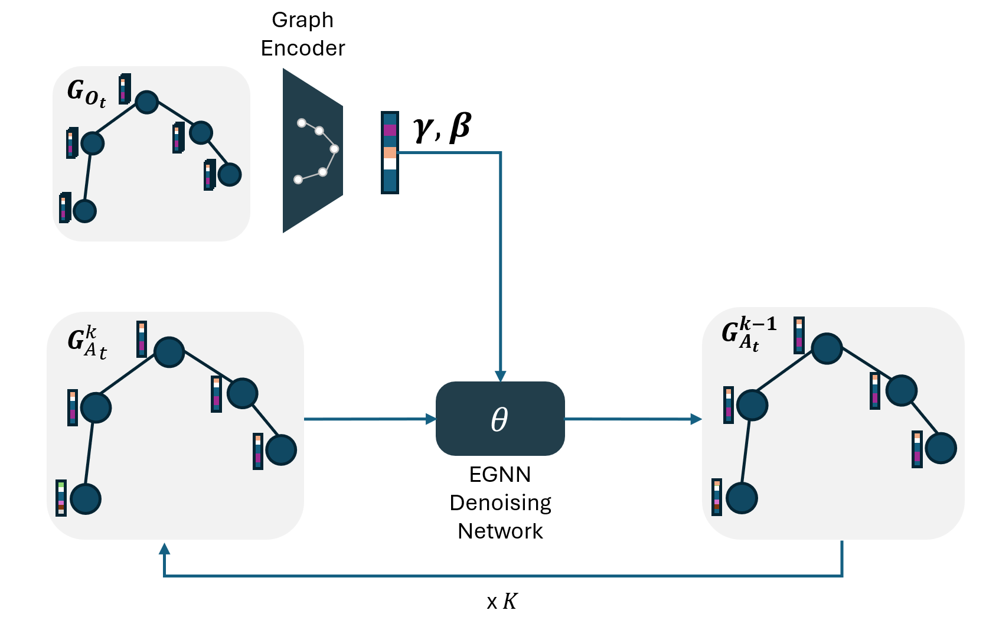
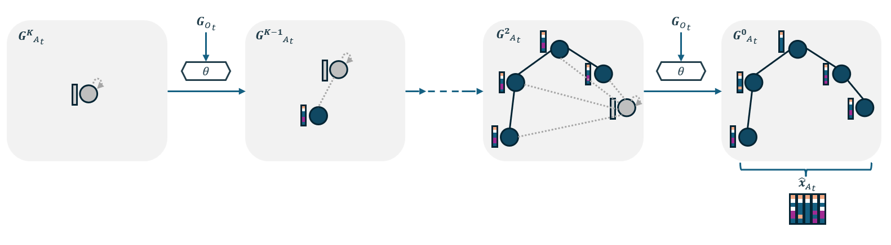

# GraphDiffusionImitate

[Caio Freitas](https://caio-freitas.github.io/)

Official implementation of master's thesis "Graph Diffusion for Imitation Leraning in Robotics" at [IAS](https://www.ias.informatik.tu-darmstadt.de/)/[PEARL](https://pearl-lab.com/) - TU Darmstadt, Germany.


## Installation

To install the dependencies, run 
```
$ mamba env create -f conda_environment.yaml
```

### On using Robosuite

When using robosuite, the environments are based on v1.4.1 but using the direct joint values as well in the actions. To add that to the robosuite environments, the file `robosuite/robosuite/models/robots/robot.py` should be modified to include (flag as True) the `robot{i}_joint_pos` in the `actives` list in the `setup_observables()` method (line 204).
### Downloading training data

To download the training data used (from the Robomimic project), use the following commands from within the `robomimic/robomimic/scrips` directory:

```bash
# Download from robomimic
python download_datasets.py --tasks lift square transport --dataset_types ph mh --hdf5_types low_dim
# Move to /data directory
cd ../../datasets
mv * ~/workspace/GraphDiffusionImitate/data/
```

## Graph Diffusion Policies

### GraphDDPM

Denoising diffusion on top of the graph's node features, based on Denoising Diffusion Probabilistic Models (DDPM) from [Ho et al.](https://arxiv.org/abs/2102.08602).

<center>

</center>

### ARGG (Autorregressive Graph Generative Policy)

Autoregressive graph generation for an graph-structured robot action, based on the GraphARM model from [Kong et al.](https://arxiv.org/pdf/2307.08849).



### Acknowledgements
This repo relies on the following existing codebases / datasets:
* Dataset from lift, square and transport tasks from [robosuite](https://robomimic.github.io/docs/datasets/robosuite.html)
* Benchmark model from [diffusion_policy](https://github.com/columbia-ai-robotics/diffusion_policy)
* EGNN implementation from [Satorras](https://github.com/vgsatorras/egnn/)